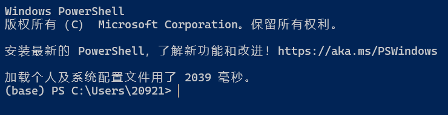

# Conda 相关问题

## Miniconda3 在 Ubuntu 环境下的安装

在 Ubuntu 环境下一般使用命令来获取 Miniconda3 的安装包

在终端中输入下列命令来获取最新版本的 Miniconda3

`wget https://repo.anaconda.com/miniconda/Miniconda3-latest-Linux-x86_64.sh`

在下载完毕之后，可能会遇到执行权限的问题，需要给安装包添加可执行权限

`sudo chmod +x Miniconda3-latest-Linux-x86_64.sh`

添加完权限之后，即可运行安装脚本

`./Miniconda3-latest-Linux-x86_64.sh`

## 终端自动启动 Conda Base 环境

在安装了 Conda 后，有时打开终端会自动激活 Conda Base 环境，如下图所示

要取消自动激活环境的功能，只需要在终端中输入 

`conda config --set auto_activate_base false`