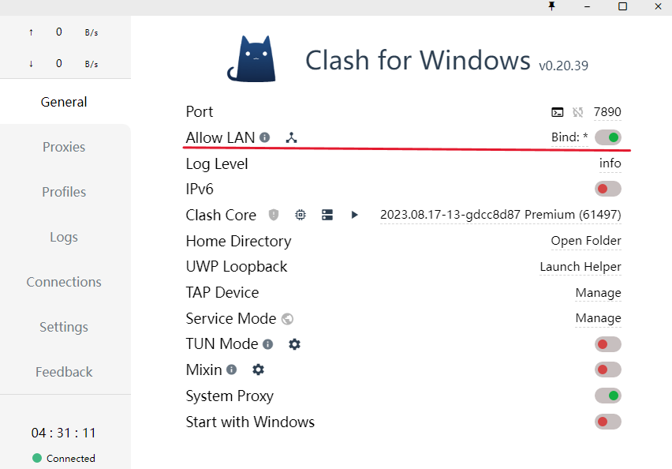

# WSL2 终端代理配置 Clash

## 0. 准备条件

笔者使用的操作系统为 Windows 11 家庭版 24H2，CPU 为 AMD Ryzen 系列，WSL2 安装的 Linux 发行版为 Ubuntu-22.04。

默认已经安装好 WSL2，以及相应的魔法软件 Clash。



上图中打开 **Allow LAN** 以及 **System Proxy**，默认端口（Port）为 7890，请根据情况自行调整。

## 1. 使用方法

在终端中创建文件 `proxy.sh`，复制下列内容，运行即可。

参考的运行指令如下，其中文件路径自行调整

`source ~/proxy.sh set`   打开代理

`source ~/proxy.sh test`  测试是否成功代理

`source ~/proxy.sh unset` 取消代理

## 2. 指令简化

此外，也可以在 bash 配置文件 `.bashrc` 中添加 `alias proxy="source ~/proxy.sh"`来简化使用。

简化后指令如下（记得使用 `source .bashrc` 命令来应用配置文件）

`proxy set`   打开代理

`proxy test`  测试是否成功代理

`proxy unset` 取消代理

## 3. 脚本参考

!!! note "注意"
    脚本中使用了 `ip route` 来获取 WSL2 的 IP 地址。以往通常使用的 `cat /etc/resolv.conf` 中保存的 nameserver 来作为 IP 地址已经不再适用。

```bash
#!/bin/sh

hostip=$(ip route | grep default | awk '{print $3}')
wslip=$(hostname -I | awk '{print $1}')
port=7890

PROXY_HTTP="http://${hostip}:${port}"
PROXY_SOCKS5="socks5://${hostip}:${port}"

set_proxy() {
  export http_proxy="${PROXY_HTTP}"
  export HTTP_PROXY="${PROXY_HTTP}"

  export https_proxy="${PROXY_HTTP}"
  export HTTPS_PROXY="${PROXY_HTTP}"

  export all_proxy="${PROXY_SOCKS5}"
  export ALL_PROXY="${PROXY_SOCKS5}"

  git config --global http.proxy "${PROXY_HTTP}"
  git config --global https.proxy "${PROXY_HTTP}"

  echo "Terminal proxy has been opened."
}

unset_proxy() {
  unset http_proxy
  unset HTTP_PROXY

  unset https_proxy
  unset HTTPS_PROXY

  unset all_proxy
  unset ALL_PROXY

  git config --global --unset http.proxy
  git config --global --unset https.proxy
  git config --global --unset http.https://github.com.proxy
  git config --global --unset https.https://github.com.proxy

  echo "Terminal proxy has been closed."
}

test_connection() {
  echo "Host IP: ${hostip}"
  echo "WSL IP: ${wslip}"
  echo "Test Connection: connecting to Google..."
  res=$(curl -I -s --connect-timeout 5 -m 5 -w "%{http_code}" -o /dev/null https://www.google.com)
  if [ "${res}" = "200" ]; then
    echo "Terminal proxy setup succeeded!"
  else
    echo "Terminal proxy setup failed!"
  fi
}

if [ "$1" = "set" ]; then
    set_proxy
elif [ "$1" = "unset" ]; then
    unset_proxy
elif [ "$1" = "test" ]; then
    test_connection
else
    echo "Unsupported arguments."
fi
```