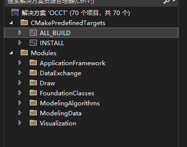
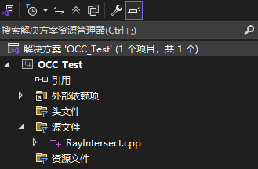
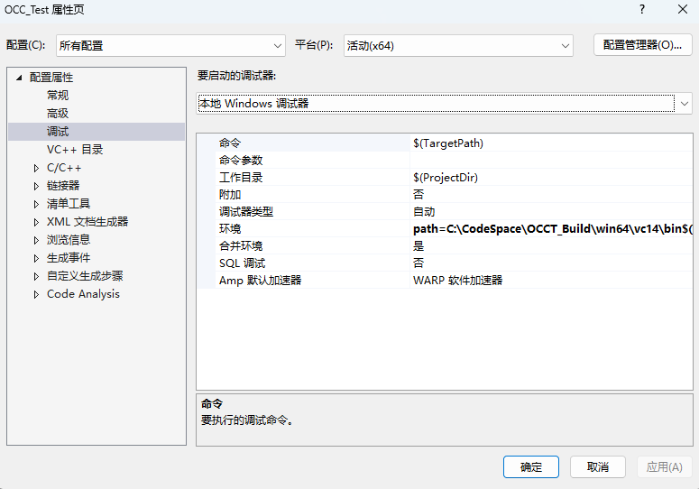
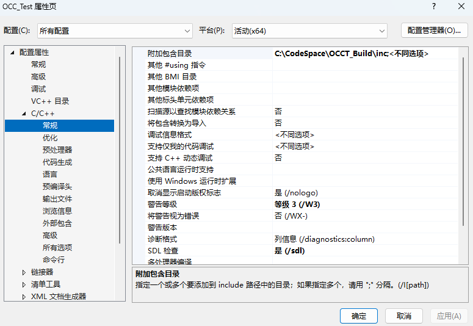
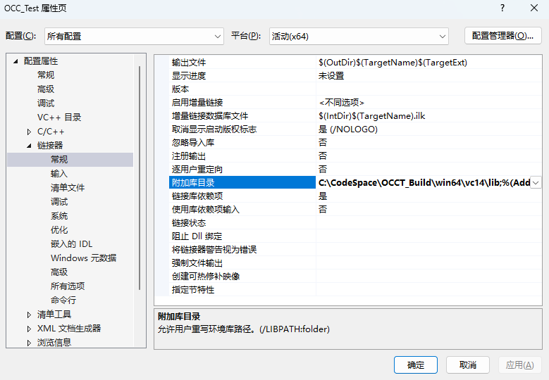
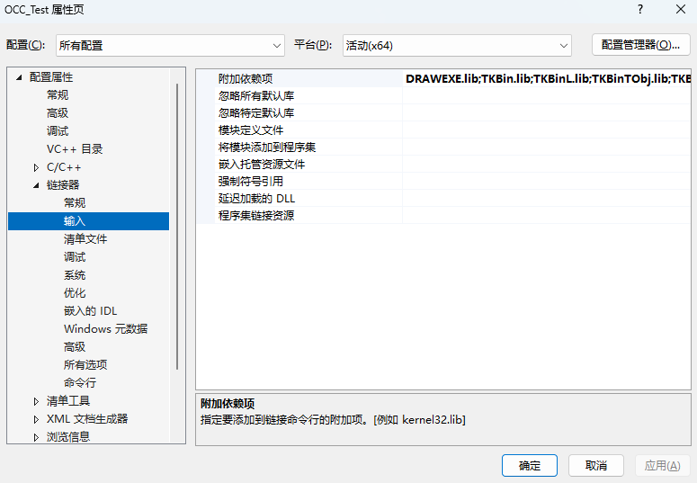

# 如何使用 OCC 内核编写脚本

## 0. Visual Studio 工程名称

本文中一共用到三个 Visual Studio 工程，其代称意义如下。

- OCCT：下载好的 OCC 源码工程
- OCCT_Build：OCC 源码经过 CMake 构建之后的工程
- OCC_Test：准备使用 OCC 内核编写脚本的工程

此外，本文中提到的 `OCCT` 即 `OCC Technology`，一般在文件路径中用到该名称

## 1. OCC 编译



在下载好 OCC 的源码并通过 CMake 构建之后，会得到上图所示的 OCC 解决方案（此处目录为下文提到的 `Your_OCCT_BuildPath`）。

右键选择 `CMakePredefinedTargets` 文件夹中的 `ALL_BUILD`，点击`生成`，即编译所有的目标。

这一步主要是为了生成编写 OCC 内核脚本所需要的 lib 和 dll 文件


## 2. 设置依赖文件



使用 Visual Studio 构建的 OCC 脚本工程如上图所示，接着右键选择 `OCC_Test`，点击`属性`，进行编辑。

注意在`属性`页面中，配置默认为 `DEBUG` 模式，建议先选择为`所有配置`模式


### 2.1 设置 dll 环境



点击`配置属性`->`调试`->`环境`，输入 `path=Your_OCCT_BuildPath\win64\vc14\bin`

在启动项目时根据该设置可以自动链接到 dll 文件


### 2.2 设置头文件目录



点击`配置属性`->`C/C++`->`常规`->`附加包含目录`，输入 `Your_OCCT_BuildPath\inc`


### 2.3 设置 lib 目录



点击`配置属性`->`链接器`->`常规`->`附加库目录`，输入   `Your_OCCT_BuildPath\win64\vc14\lib`


### 2.4 设置使用到的 lib 文件



点击`配置属性`->`链接器`->`输入`->`附加依赖项`，输入 `Your_OCCT_BuildPath\win64\vc14\lib` 中的所有文件类型为 lib 的完整文件名

此处建议使用下列 CMD 命令将完整文件名输出为一个 txt 文件后复制输入，手动输入过于麻烦

进入到 lib 文件目录后，打开 CMD，输入：`dir /b *.lib > lib_list.txt`


### 2.5 复制 freetype.h 文件

进入到 OCC 源码中，若 OCC 已经通过 CMake 构建，则认为已经设置好所需的所有第三方依赖

在其第三方依赖中需要的 `freetype.dll` 通常存放在 OCC 源码目录中

比如目录：`OCCT\3rdparty-vc14-64\freetype-2.13.3-x64\bin\freetype.dll`

将 `freetype.dll` 复制到构建好的 OCC 解决方案目录中：`OCCT_Build\win64\vc14\bin`

注：这里复制该文件是为了使用 OCC 的读入 STEP 文件函数，根据实际情况自行选择


## 3. 示例脚本

完成上述步骤后，已经可以运行下列光线与 CAD 模型求交的脚本

注：将下列脚本放到上面提到的 OCC_Test 工程源码中即可

```c++
#include <TopoDS_Shape.hxx>
#include <TopExp_Explorer.hxx>
#include <BRepTools.hxx>
#include <IntCurvesFace_Intersector.hxx>
#include <gp_Lin.hxx>
#include <gp_Pnt.hxx>
#include <gp_Dir.hxx>
#include <BRep_Builder.hxx>
#include <TopAbs.hxx>
#include <TopoDS_Face.hxx>
#include <iostream>
#include <TopoDS.hxx>
#include <STEPControl_Reader.hxx>
#include <IFSelect_ReturnStatus.hxx>
#include <string>

void ReadStepFile(TopoDS_Shape& resShape, const std::string& fileName) 
{
    STEPControl_Reader reader;
    IFSelect_ReturnStatus status = reader.ReadFile(fileName.c_str());

    if (status != IFSelect_RetDone) 
    {
        std::cerr << "Failed to read STEP file." << std::endl;
        return;
    }

    // Turn STEP data into OCC Topo Data
    bool failsonly = false;
    reader.PrintCheckLoad(failsonly, IFSelect_ItemsByEntity);
    reader.TransferRoots();

    // Get TopoDS_Shape
    resShape = reader.OneShape();
    std::cout << "STEP file loaded successfully." << std::endl;
}

int main() 
{
    TopoDS_Shape shape;
    BRep_Builder builder;
    std::string fileName = "YourStep.stp";

    ReadStepFile(shape, fileName);

    gp_Pnt origin(0, 0, 100);
    gp_Dir dir(0, 0, -1);
    gp_Lin ray(origin, dir);

    for (TopExp_Explorer exp(shape, TopAbs_FACE); exp.More(); exp.Next()) 
    {
        TopoDS_Face face = TopoDS::Face(exp.Current());
        IntCurvesFace_Intersector intersector(face, 1e-7);
        intersector.Perform(ray, 0.0, 1000.0);

        if (intersector.IsDone()) 
        {
            if (intersector.NbPnt() <= 0)
            {
                std::cout << "Not Hit!" << std::endl;
            }
            for (int i = 1; i <= intersector.NbPnt(); ++i) {
                gp_Pnt pt = intersector.Pnt(i);
                std::cout << "Hit at: " << pt.X() << ", " << pt.Y() << ", " << pt.Z() << std::endl;
            }
        }
    }

    return 0;
}
```


