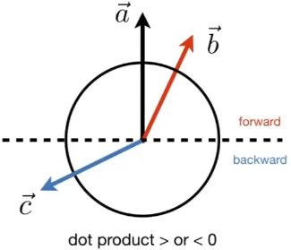
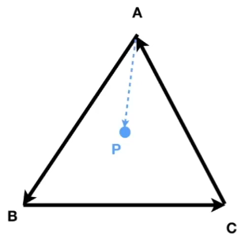

# Lecture 02 Review of Linear Algebra

## 向量点乘

在图形学中通常将 $n \times 1$ 的矩阵称为向量

向量的点乘可以判断方向性，＞0为方向基本一致，＜0为方向基本相反，=0为垂直

## 向量叉乘

分别使用  $\overrightarrow{x}$，$\overrightarrow{y}$，$\overrightarrow{z}$  来代表三维坐标向量，有以下的叉乘关系，可以通俗的记忆为轮换关系

$$
\overrightarrow{x} \times \overrightarrow{y} = +\overrightarrow{z} \quad \quad
\overrightarrow{y} \times \overrightarrow{x} = -\overrightarrow{z} \\\
\overrightarrow{y} \times \overrightarrow{z} = +\overrightarrow{x} \quad \quad
\overrightarrow{z} \times \overrightarrow{y} = -\overrightarrow{x} \\\\
\overrightarrow{z} \times \overrightarrow{x} = +\overrightarrow{y} \quad \quad
\overrightarrow{x} \times \overrightarrow{z} = -\overrightarrow{y} 
$$

向量叉乘计算可使用公式，得到的结果向量方向符合右手定则，即逆时针方向

所得结果为正向，代表 $\overrightarrow{b}$  在  $\overrightarrow{a}$   的左侧

所得结果为负向，代表 $\overrightarrow{b}$  在  $\overrightarrow{a}$   的右侧

$$
\overrightarrow{a} \times \overrightarrow{b} = 
\left(\begin{matrix}
y_a z_b - y_b z_a \\
z_a x_b - x_a z_b \\
x_a y_b - y_a x_b \\
\end{matrix}\right)
$$

通过叉乘可以判断点是否在多边形的内部

即由P点连接成的向量均在边向量的同一侧（下图示例中为左侧）

## 矩阵形式的向量乘法

- 点乘

$$
\overrightarrow{a} \cdot \overrightarrow{b} = 
\overrightarrow{a} ^ {\mathrm{T}} \overrightarrow{b} = 
\left(\begin{matrix}
x_a & y_a & z_a
\end{matrix}\right)
\left(\begin{matrix}
x_a \\ y_a \\ z_a
\end{matrix}\right) = 
\left(\begin{matrix}
x_a x_b + y_a y_b + z_a z_b
\end{matrix}\right)
$$

- 叉乘

$$
\overrightarrow{a} \times \overrightarrow{b} = A^*b =
\left(\begin{matrix}
0 & -z_a & y_a \\
z_a & 0 & -x_a \\ 
-y_a & x_a & 0
\end{matrix}\right) 
\left(\begin{matrix}
x_b \\ y_b \\ z_b
\end{matrix}\right)
$$

注意上述公式中 A* 代表由 a 向量的 dual matrix
