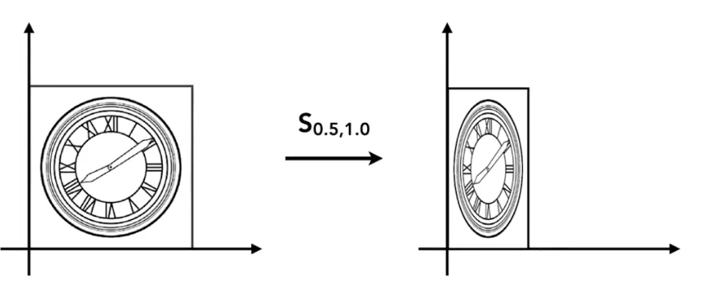
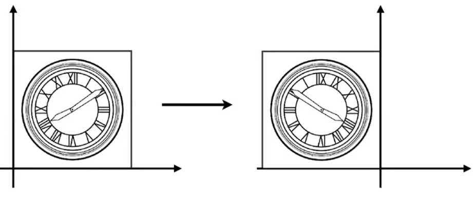
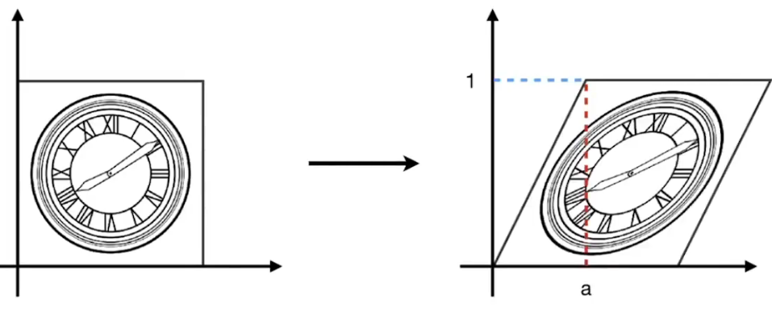
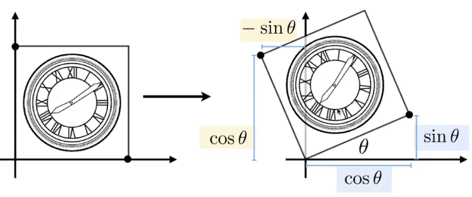
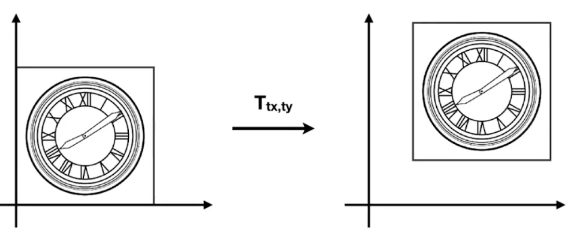
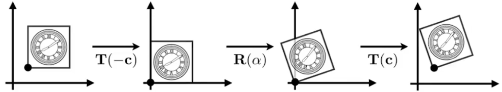

# Lecture 03 Transformation

## 2D 变换

2D平面上的基础变换矩阵可以通过原点进行推导

### 线性变换

$$
x^{'} = ax + by \\
y^{'} = cx + dy \\
\space \\
\left(\begin{matrix}
x^{'} \\ y ^{'}
\end{matrix}\right) =
\left(\begin{matrix}
a & b \\
c & d
\end{matrix}\right)
\left(\begin{matrix}
x \\ y 
\end{matrix}\right) \\
\space \\
{\mathrm{x}}^{'} = \mathrm{M}\mathrm{x}
$$

### 缩放

$$
\left(\begin{matrix}
x^{'} \\ y ^{'}
\end{matrix}\right) =
\left(\begin{matrix}
s_x & 0 \\
0 & s_y
\end{matrix}\right)
\left(\begin{matrix}
x \\ y 
\end{matrix}\right) 
$$

其中$s_x$代表x轴方向的缩放大小，$s_y$代表y轴方向的缩放大小

以上图图示为例 $s_x = 0.5,s_y=1.0$

### 水平翻转

$$
x_{'} = -x \\ 
y_{'} = y \\
\space \\
\left(\begin{matrix}
x^{'} \\ y ^{'}
\end{matrix}\right) =
\left(\begin{matrix}
-1 & 0 \\
0 & 1
\end{matrix}\right)
\left(\begin{matrix}
x \\ y 
\end{matrix}\right) 
$$

上述公式代表水平翻转矩阵，垂直翻转矩阵可类推

### 切变矩阵

$$
\left(\begin{matrix}
x^{'} \\ y ^{'}
\end{matrix}\right) =
\left(\begin{matrix}
1 & a \\
0 & 1
\end{matrix}\right)
\left(\begin{matrix}
x \\ y 
\end{matrix}\right) \\
$$

以上图为例，图形底部未进行偏移，而y轴上值越大，x轴上的偏移越大

### 旋转矩阵(原点，逆时针)

$$
\mathrm{R_{\theta}} =
\left(\begin{matrix}
\cos \theta & -\sin \theta \\
\sin \theta & \cos \theta
\end{matrix}\right)
$$

其中有一条重要的性质如下

$$
\mathrm{R_{-\theta}} =
\left(\begin{matrix}
\cos \theta & \sin \theta \\
-\sin \theta & \cos \theta
\end{matrix}\right) = 
\mathrm{R_{\theta}^T}
$$

并且以原点为中心旋转 $\theta$ 角度和 $-\theta$ 角度是互逆的操作

$$
\mathrm{R_{-\theta}} =
\mathrm{R_{\theta}^T} =
\mathrm{R_{\theta}^{-1}}
$$

即转置矩阵等于逆矩阵

## 齐次坐标

$$
x_{'} = x + t_x \\ 
y_{'} = y + t_y\\
$$

- 平移不能用上述的矩阵形式表示，所以 **平移并不是线性变换**

$$
\left(\begin{matrix}
x^{'} \\ y ^{'}
\end{matrix}\right) =
\left(\begin{matrix}
a & b \\
c & d
\end{matrix}\right)
\left(\begin{matrix}
x \\ y 
\end{matrix}\right) +
\left(\begin{matrix}
t_x \\ t_y 
\end{matrix}\right)
$$

### 解决办法

**引入第三维 (w-coordinate)**

- $2D \space point = (x, y, 1)^{T}$

- $2D \space vector = (x, y, 0)^{T}$

齐次坐标下，第三维为1代表点，为0代表向量

**平移的矩阵表达形式（使用齐次坐标）**

$$
\left(\begin{matrix}
x^{'} \\ y^{'} \\ w^{'}
\end{matrix}\right) =
\left(\begin{matrix}
1 & 0 & t_x \\
0 & 1 & t_y \\
0 & 0 & 1
\end{matrix}\right)
\left(\begin{matrix}
x \\ y \\ 1
\end{matrix}\right) +
\left(\begin{matrix}
x + t_x \\ y + t_y \\ 1 
\end{matrix}\right)
$$

### w 分量相关

- **vector + vector = vector**
- **point - point      = vector**
- **point + vector   = point**
- **point + point     = point** (两点相加，得到结果为这两点的连线中点)

在齐次坐标中，有如下规定

$$
\left(\begin{matrix}
x \\ y \\ w
\end{matrix}\right) \space is \space the \space 2D \space point
\left(\begin{matrix}
x/w \\ y/w \\ 1
\end{matrix}\right), \space w \neq 0
$$

### 仿射变换

仿射变换 = 线性变换 + 平移

先应用线性变换在进行平移

$$
\left(\begin{matrix}
x^{'} \\ y ^{'}
\end{matrix}\right) =
\left(\begin{matrix}
a & b \\
c & d
\end{matrix}\right)
\left(\begin{matrix}
x \\ y 
\end{matrix}\right) +
\left(\begin{matrix}
t_x \\ t_y 
\end{matrix}\right)
$$

**解决办法：使用齐次坐标**

所有的仿射变换都能写成齐次坐标的形式

$$
\left(\begin{matrix}
x^{'} \\ y ^{'} \\ 1
\end{matrix}\right) =
\left(\begin{matrix}
a & b & t_x\\
c & d & t_y \\
0 & 0 & 1
\end{matrix}\right)
\left(\begin{matrix}
x \\ y \\ 1
\end{matrix}\right)
$$

## 齐次坐标下的 2D 变换

### 缩放

$$
\mathrm{S}(s_x, s_y) =
\left(\begin{matrix}
s_x & 0 & 0\\
0 & s_y & 0 \\
0 & 0 & 1
\end{matrix}\right)
$$

### 旋转

$$
\mathrm{R}(\alpha) =
\left(\begin{matrix}
\cos \alpha & -\sin \alpha & 0\\
\sin \alpha & \cos \alpha & 0 \\
0 & 0 & 1
\end{matrix}\right)
$$

### 平移

$$
\mathrm{T}(t_x, t_y) =
\left(\begin{matrix}
1 & 0 & t_x \\
0 & 1 & t_y \\
0 & 0 & 1
\end{matrix}\right)
$$

值得注意的是，$\mathrm{M^{-1}}$ 既是变换矩阵 $\mathrm{M}$ 的逆矩阵，也是逆变换

## 组合变换

**变换的顺序是至关重要的！**

- 矩阵乘法不满足交换律

$$
\mathrm{R_{45}} \cdot \mathrm{T_{(1,0)}} \neq \mathrm{T_{(1,0)}} \cdot \mathrm{R_{45}}
$$

- 注意矩阵的结合顺序是从右到左的

$$
\mathrm{T_{(1,0)}} \cdot \mathrm{R_{45}}
\left(\begin{matrix}
x \\ y \\ 1
\end{matrix}\right) = 
\left(\begin{matrix}
1 & 0 & 1\\
0 & 1 & 0 \\
0 & 0 & 1
\end{matrix}\right)
\left(\begin{matrix}
\cos 45 \degree & -\sin 45 \degree & 0 \\
\sin 45 \degree & \cos 45 \degree & 0 \\
0 & 0 & 1
\end{matrix}\right)
\left(\begin{matrix}
x \\ y \\ 1
\end{matrix}\right)
$$

- 仿射变换矩阵的结合顺序
  
$$
A_n(...A_2(A_1(\mathrm{x}))) = \mathrm{A_n}\cdot\cdot\cdot\mathrm{A_2}\cdot\mathrm{A_1}\cdot
\left(\begin{matrix}
x \\ y \\ 1
\end{matrix}\right)
$$
  

**围绕特定点（非原点）进行旋转**

- 将中心平移到原点
- 进行旋转
- 将中心平移回特定点

$$
\mathrm{T(c)} \cdot \mathrm{R(\alpha)} \cdot \mathrm{T(-c)}
$$

