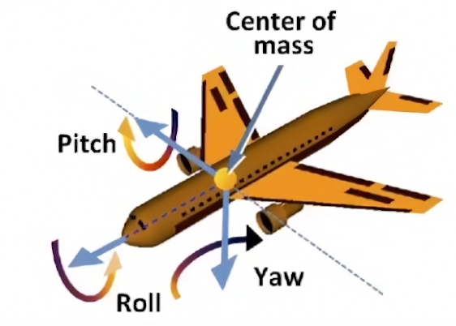

# Lecture 04 Transformation Cont.

## 齐次坐标下的 3D 变换

### 仿射变换

3D 空间下的点和向量也可以写成齐次形式

- $3D \space Point = (x, y, z, 1)^{T}$
- $3D \space Vector = (x, y, z, 0)^{T}$ 

$(x, y, z, w)$ 是一个 3D Point $(x/w, y/w, z/w), w \neq 0$

使用 4 x 4 的矩阵来表示仿射变换，先应用线性变换再平移

$$
\left(\begin{matrix}
x^{'} \\ y^{'} \\ z^{'} \\ 1
\end{matrix}\right) =
\left(\begin{matrix}
a & b & c & t_x \\
d & e & f & t_y \\
g & h & i & t_z \\
0 & 0 & 0 & 1
\end{matrix}\right)
\left(\begin{matrix}
x \\ y \\ z \\ 1
\end{matrix}\right) 
$$

### 缩放矩阵

$$
\mathrm{S}(s_x, s_y, s_z) =
\left(\begin{matrix}
s_x & 0 & 0 & 0\\
0 & s_y & 0 & 0\\
0 & 0 & s_z & 0\\
0 & 0 & 0 & 1
\end{matrix}\right)
$$

### 平移矩阵

$$
\mathrm{T}(t_x, t_y, t_z) =
\left(\begin{matrix}
1 & 0 & 0 & t_x\\
0 & 1 & 0 & t_y\\
0 & 0 & 1 & t_z\\
0 & 0 & 0 & 1
\end{matrix}\right)
$$

### 旋转矩阵

旋转矩阵根据绕轴的不同可以分为三种

$$
\mathrm{R_x}(\alpha) =
\left(\begin{matrix}
1 & 0 & 0 & 0\\
0 & \cos{\alpha} & -\sin{\alpha} & 0\\
0 & \sin{\alpha} & \cos{\alpha} & 0\\
0 & 0 & 0 & 1
\end{matrix}\right)
$$

$$
\mathrm{R_y}(\alpha) =
\left(\begin{matrix}
\cos{\alpha} & 0 & \sin{\alpha} & 0\\
0 & 1 & 0 & 0\\
-\sin{\alpha} & 0 & \cos{\alpha} & 0\\
0 & 0 & 0 & 1
\end{matrix}\right)
$$

$$
\mathrm{R_z}(\alpha) =
\left(\begin{matrix}
\cos{\alpha} & -\sin{\alpha} & 0 & 0\\
\sin{\alpha} & \cos{\alpha} & 0 & 0\\
0 & 0 & 1 & 0\\
0 & 0 & 0 & 1
\end{matrix}\right)
$$

此外，任意的旋转可以通过组合表示

$$
\mathrm{R_{xyz}}(\alpha, \beta, \gamma) =
\mathrm{R_{x}}(\alpha)
\mathrm{R_{y}}(\beta)
\mathrm{R_{z}}(\gamma)
$$

这种组合也被称作 **欧拉角（Euler angles）**

**Rodrigues 旋转公式**

绕坐标轴 $\overrightarrow{n}$ 旋转角度 $\alpha$ 可写成公式

$$
\mathrm{R}(\mathrm{n}, \alpha) =
\cos{(\alpha)}\mathrm{I} + 
(1 - \cos{(\alpha)})\mathrm{n}\mathrm{n}^{T} +
\sin{(\alpha)}\mathrm{N}
$$

$$
\mathrm{N} = 
\left(\begin{matrix}
0 & -n_z & n_y\\
n_z & 0 & -n_x\\
-n_y & n_x & 0
\end{matrix}\right)
$$

公式证明见 GAMES101 课程网站论坛

!!! note "注意"
    这里提到的坐标轴默认是过原点的，所以可以用方向向量表示。若不过原点可以先平移到原点最后再平移回去。

