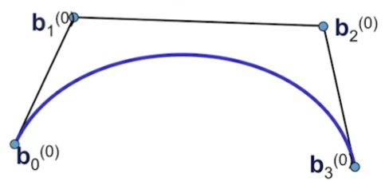
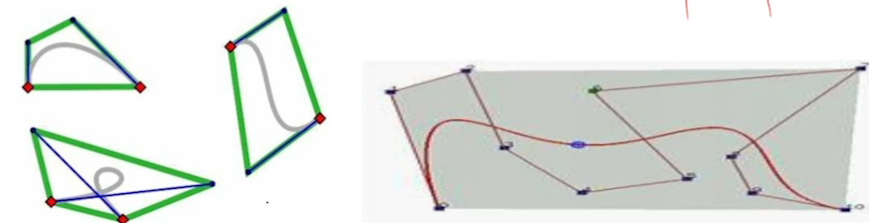
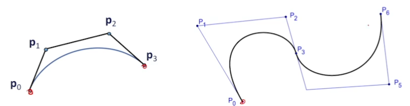
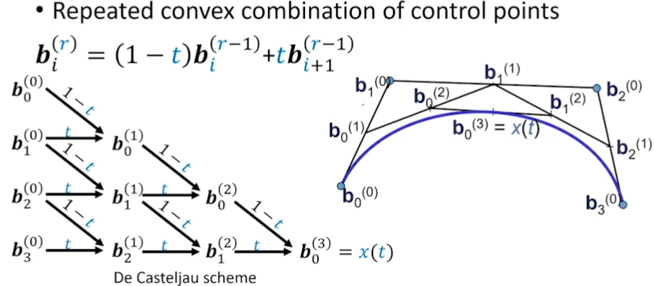
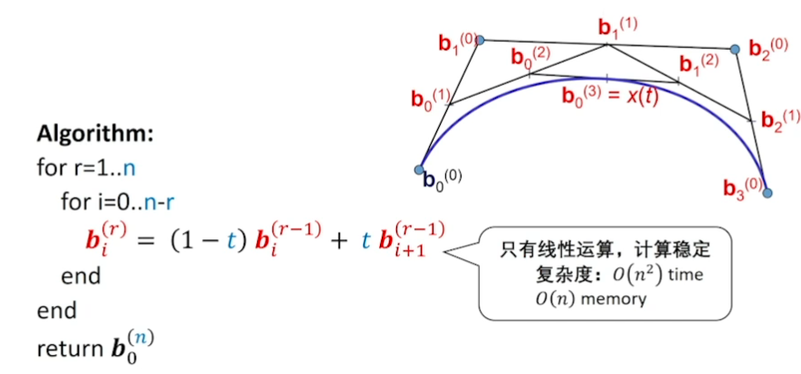

# Lec05 Bezier曲线 B样条曲线

## 建模的两种形式

$$
f(t) = at^2 + bt + c
$$

**重建（Reconstruction）**

- 逆向工程：形状已有，将其“猜”出
- 采样→拟合：需要函数空间足够丰富（表达能力够）
- **代数观点**：$\{a,b,c\}$作为基函数的组合权系数

**设计（Design）**

- 自由设计：凭空产生，或从一个简单形状编辑得到
- 交互式编辑：几何直观性要好
- **几何观点**：基函数$\{t^2,t,1\}$作为控制点的组合权系数

## Bernstein基函数

- n次（n + 1阶）Bernstein基函数：$B=\{B_{0}^{(n)},B_{1}^{(n)},...,B_{n}^{(n)}\}$

$$
B_{i}^{n}(t) = \tbinom{n}{i} t^i (1-t)^{n-i} = B_{i-th \space basis \space function}^{(degree)} \\
\space \\
\tbinom{n}{i} = \begin{cases}
\frac{n!}{(n-i)!i!} \ for \ 0 \leq i \leq n \\
0 \qquad otherwise
\end{cases}
$$

- 对称性：$B_{i}^n(t) = B_{n-i}^n(1-t)$
- $B_{i}^{(n)}(t)$ 在 $t = \frac{i}{n}$ 达到最大值

用Bernstein基函数所表达的曲线具有非常好的几何意义

### 性质

#### 性质1. 正权性

**正性（非负性） +  权性**

- $B_{i}^{(n)}(t) \geq 0,\ \forall t \in [0,1]$
- $\sum\nolimits^{n}_{i=1} B_{i}^{(n)}(t) = 1, \ \forall t \in [0,1]$

可由该性质得到Bezier曲线的 **凸包性**

（用不严谨的话来讲，给定二维平面上的点集，凸包就是将最外层的点连接起来构成的凸多边形，它能包含点集中所有的点）

#### 性质2. 基性

- $B={B_0^{(n)}, B_1^{(n)},...,B_n^{(n)}}$是次数不高于n的多项式集合（空间）的一组基
- 与幂基可以相互线性表达：

$$
\left[\begin{matrix}
B_{0,n}(t) & B_{1,n}(t) & ... & B_{n,n}(t) 
\end{matrix}\right] = 
\left[\begin{matrix}
1 & t & t^2 & \dots & t^n
\end{matrix}\right]
\left[\begin{matrix}
b_{0,0} & 0 & 0 & \dots & 0 \\
b_{1,0} & b_{1,1} & 0 & \dots & 0 \\
b_{2,0} & b_{2,1} & b_{2,2} & \dots & 0 \\
\vdots & \vdots & \vdots & \ddots & \vdots \\
b_{n,0} & b_{n,1} & b_{n,2} & ... & b_{n,n} 
\end{matrix}\right]
$$

#### 性质3. 递推公式

- 基函数的递推公式
$$
B_i^{n}(t) = (1-t)B_i^{(n-1)}(t) + tB_{i-1}^{(n-1)}(t) \\
with \ B_0^{0}(t) = 1, B_i^{n}(t) = 0 \ for \ i \notin \{0 \dots n\}
$$

- 由$\tbinom{n-1}{i} + \tbinom{n-1}{i-1} = \tbinom{n}{i}$可推导得到
- 高阶的基函数由2个低阶的基函数“升阶”得到，利于保持一些良好性质

#### 性质4. 端点插值性

- $B_0^{n}(0) = 1, B_1^{n}(0) = \dots = B_n^{n}(0) = 0$
- $B_0^{n}(1) = \dots = B_{n-1}^{n}(1) = 0, B_n^{n}(1) = 1$

可由该性质得出Bezier曲线经过首末两个控制顶点 $\boldsymbol{p_0}, \boldsymbol{p_1}$

#### 性质5. 导数

- $\frac{d}{dt}B_i^{(n)}(t) = n[B_{i-1}^{(n-1)}(t) - B_i^{(n-1)}(t)]$
- $\frac{d^2}{dt^2}B_i^{(n)}(t) = n(n-1)[B_{i-2}^{(n-2)}(t) - 2B_{i-1}^{(n-2)}(t) + B_i^{(n-2)}(t)]$

#### 性质6. 升阶

$$
(1-t)B_i^{n}(t) = (1 - \frac{i}{n+1})B_i^{n+1}(t) \\
\space \\
tB_i^{n}(t) = \frac{i+1}{n+1} B_i^{n+1}(t)
$$

- Bezier曲线的升阶由上述公式推出
  $$
  \boldsymbol{f}(t) = \sum_{i=0}^{n+1} B_i^{n+1}(t)[\frac{n+1-i}{n+1}\boldsymbol{P_i} + \frac{i}{n+1}\boldsymbol{P_{i-1}}]
  $$
  

## Bezier曲线

- n次Bezier曲线：$n+1$ 个控制顶点

$$
x(t) = \sum_{i=0}^n B_{i}^n (t) \cdot b_i
$$

由控制顶点$b_i$来控制多边形

Bezier曲线的性质来源于Bernstein基函数的性质（曲线是控制顶点的线性组合构成的，基函数提供了组合系数）

- Bezier曲线端点的切线方向与边相同

### De Casteljau algorithm

**算法描述**

- 输入：点 $\boldsymbol{b_0,b_1,\dots,b_n} \in \mathbb{R}^{3}$
- 输出：曲线 $\boldsymbol{x}(t), \ t \in [0, 1]$

$$
\boldsymbol{b}_i^{0}(t) = \boldsymbol{b}_i, \quad i = 0, \dots, n \\
\boldsymbol{b}_i^{r}(t) = (1-t)\boldsymbol{b}_i^{r-1}(t) + t\boldsymbol{b}^{r-1}_{i+1}(t) \\
r = 1, \dots, n \qquad i = 0, \dots, n - r
$$

算法伪代码如下：

- 计算Bezier曲线 $\boldsymbol{x}(t)$ 上参数为 $t$ 的点
- 良好的几何意义：该点将曲线一分两条子Bezier曲线，其控制顶点是中间生成的点
- 可用于Bezier曲线的离散及求根等许多应用