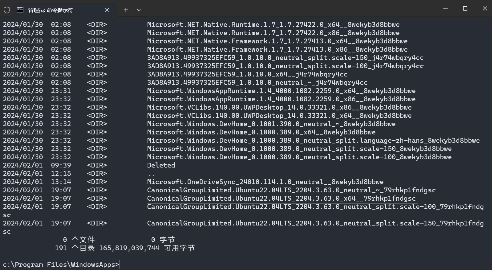

# Win11 家庭版配置 WSL2

## 0. 安装环境

笔者使用的操作系统为 Windows 11 家庭版，CPU 为 AMD Ryzen 系列。

本教程将安装 WSL2 至非C盘（D盘）。

由于 Windows 11 家庭版不支持 Hyper-V 功能，需要手动设置开启。

新建 txt 文件命名为 hyper-v (hyper-v.txt)，并复制下述代码内容。

```bat
pushd "%~dp0"

dir /b %SystemRoot%\servicing\Packages\*Hyper-V*.mum >hyper-v.txt

for /f %%i in ('findstr /i . hyper-v.txt 2^>nul') do dism /online /norestart /add-package:"%SystemRoot%\servicing\Packages\%%i"

del hyper-v.txt

Dism /online /enable-feature /featurename:Microsoft-Hyper-V-All /LimitAccess /ALL

pause
```

修改文件后缀为 .cmd，即保存为 cmd 格式的文件（需要先取消隐藏文件后缀名功能）。

右键点击以管理员身份运行，可能出现循环运行现象，注意关闭。

!!! note "踩坑"
    笔者安装过程中曾将上述文件后缀改为 .bat，会报错 “Microsoft-Hyper-V 未知。 未识别出 Windows 功能名称。”。

完成上述准备后，在启用或关闭 Windows 功能面板处勾选以下几项：

- Hyper-V
- Windows 虚拟机监控平台
- 适用于 Linux 的 Windows 子系统
- 虚拟机平台


## 1. 安装包下载

在系统自带应用中打开 Microsoft Store，搜索 Ubuntu 并挑选自己需要的版本进行下载，此处为 22.04.3 LTS 版本。


## 2. 提取安装包

下载完成后，先不要运行。使用管理员身份运行命令行，输入 `cd C:\Program Files\WindowsApps` 即进入到默认的商店应用保存路径。

键入 `dir/od` 来查看多出来的子目录。需要选择带有 **Ubuntu** 以及 **x64** 字样的目录，先记住大致的目录名。



接下来使用文件资源管理器找到对应目录，设置打开权限。

依次点开 属性->安全->高级->更改所有者，输入 everyone。（**可能存在安全风险，请慎重考虑**）


勾选替换子容器和对象的所有者，应用并确定。


打开后选择上述确定的子目录的所有内容，复制到D盘的新建文件夹。例如：`D:\WSL2-Ubuntu-22.04`


## 3. 安装实例

在命令行中输入 `wsl --set-default-version 2`，表示默认使用 WSL2 的方式进行安装。

下载 Windows Subsystem for Linux Update Setup 程序进行安装，链接自行搜索或点击下方。

https://wslstorestorage.blob.core.windows.net/wslblob/wsl_update_x64.msi


一路点击 Next 进行安装即可。 

完成后接下来直接点击 `D:\WSL2-Ubuntu-22.04\ubuntu2204.exe` 进行安装。

安装完成后可在命令行输入 `wsl --status` 来检查是否为 WSL2。


## 4. 安装包清理

先打开开始菜单，可见刚才安装的发行版，选择卸载（见下图）。
  
卸载的作用为清除上述C盘中WindowsApps目录中的安装包，不会对D盘的WSL2造成影响。


此外， `D:\WSL2-Ubuntu-22.04\install.tar.gz`  也可手动从文件夹中删除，其内容已经解压安装。

至此，WSL2 安装完毕。