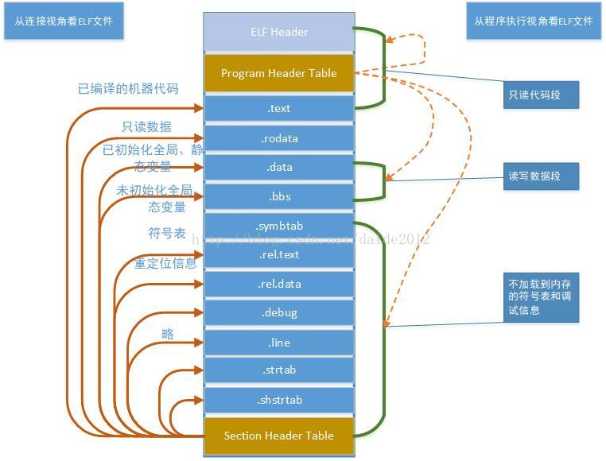
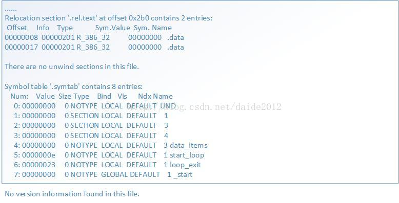
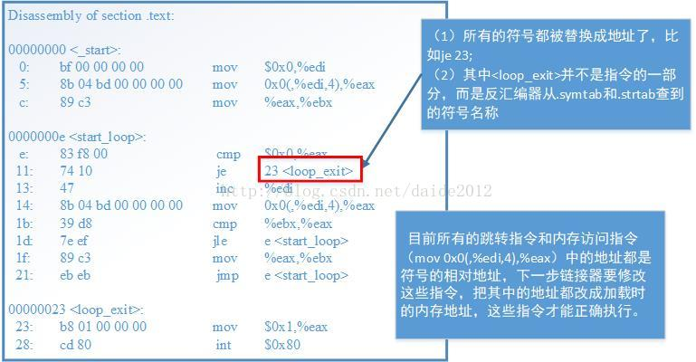
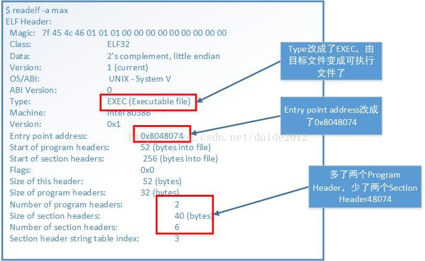
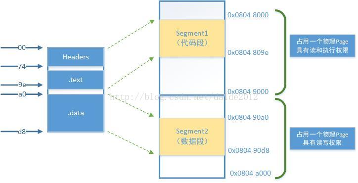

# ELF 文件初识
!!! note "本文为转载，存在部分修改"
    - [原文链接](https://blog.csdn.net/daide2012/article/details/73065204)
## 1 引言
在讲解 ELF 文件格式之前，我们来回顾一下，一个用 C 语言编写的高级语言程序从编写到打包、再到编译执行的基本过程。我们知道在 CPU 上执行的是低级别的机器语言，从高级语言到低级别的机器语言肯定是要经过翻译过程，这个过程大体的过程如下图所示:

在 Unix 系统中，从源文件到可执行目标文件是由编译驱动程序完成的，如大名鼎鼎的 gcc，翻译过程包括图中的四个阶段；

### 1.1 预处理阶段

预处理器（cpp）根据以字符`#`开头的命令修给原始的C程序，结果得到另一个C程序，通常以 .i 作为文件扩展名。

主要是进行 **文本替换、宏展开、删除注释** 这类简单工作。

对应的命令：linux> `gcc -E hello.c hello.i`

### 1.2 编译阶段

编译器将文本文件 hello.i 翻译成 hello.s，包含相应的汇编语言程序

对应的命令： linux> `gcc -S hello.c hello.s`

### 1.3 汇编阶段

将 .s 文件翻译成机器语言指令，把这些指令打包成一种叫做 **可重定位目标程序的格式**，并将结果保存在目标文件 .o 中（把汇编语言翻译成机器语言的过程）。

把一个源程序翻译成目标程序的工作过程分为五个阶段：

- 词法分析

- 语法分析

- 语义检查和中间代码生成
  
- 代码优化
  
- 目标代码生成

主要是进行 **词法分析** 和 **语法分析**，又称为源程序分析，分析过程中发现有语法错误，给出提示信息。

对应的命令： linux> `gcc -c hello.c hello.o`

### 1.4 链接阶段

此时 hello 程序调用了 printf 函数。printf 函数存在于一个名为 printf.o 的单独的预编译目标文件中。

**链接器（ld）** 就负责处理把这个文件并入到 hello.o 程序中，结果得到 hello 文件，一个可执行文件。最后可执行文件加载到储存器后由系统负责执行, 函数库一般分为 **静态库** 和 **动态库** 两种。

**静态库** 是指编译链接时，把库文件的代码全部加入到可执行文件中，因此生成的文件比较大，但在运行时也就不再需要库文件了。其后缀名一般为 .a。

**动态库** 与之相反，在编译链接时并没有把库文件的代码加入到可执行文件中，而是在程序执行时由运行时链接文件加载库，这样可以节省系统的开销。其一般后缀名为 .so，gcc 在编译时默认使用动态库。

## 2 目标文件

由上面的过程，我们可以看出在经过汇编器和连接器作用后都会输出一个目标文件，那这两个目标文件有什么样的区别呢？说到这里我们先引入目标文件的形式。

### 2.1 三种目标文件形式

- 可重定位目标文件：包含二进制代码和数据，其形式可以和其他目标文件进行合并，创建一个可执行目标文件。

- 可执行目标文件：包含二进制代码和数据，可直接被加载器加载执行。

- 共享目标文件：可被动态的加载和链接（本文暂时不讨论）。

由此可知由汇编器生成的就是 **可重定位目标文件**，经过链接器作用后才生成 **可执行目标文件**。

### 2.2 链接器的作用

链接器的作用就是以一组可重定位目标文件作为输入，生成可加载和运行的可执行目标文件，具体需要完成以下两个工作：

- 符号解析：符号解析的目的是将目标文件中每个符号（静态变量、函数、全局变量）和其定义进行关联。
  
- 重定位：将每个符号的定义与具体在虚拟内存中的位置进行关联。

最终生成可执行目标文件。

说到这里好像还是没有说清楚这两种目标文件有什么区别，我们还是先把这个问题放一下，相信你看完下一节，应该会有答案，下面我们开始引入目标文件即 ELF 文件。

## 3 ELF文件

### 3.1 命名格式

目标文件在不同的系统或平台上具有不同的命名格式。

在 Unix 和 x86-64 Linux 上目标文件统称为 **ELF (Executable and Linkable Format, ELF)**。

### 3.2 文件视角

ELF 文件格式提供了三种不同的视角，即可重定位目标文件和可执行目标文件（以及不讨论的共享目标文件）。

在汇编器和链接器看来，ELF 文件是由 Section Header Table 描述的一系列 Section 的集合，即可重定位目标文件。

而执行一个 ELF 文件时，在加载器（Loader）看来它是由 Program Header Table 描述的一系列 Segment 的集合，即可执行目标文件。

!!! note "关于 Section 和 Segment"
    我们在汇编程序中用`.section`声明的 Section 会成为目标文件中的 Section。此外汇编器还会自动添加一些 Section（比如符号表）。
    
    Segment 是指在程序运行时加载到内存的具有相同属性的区域，由一个或多个 Section 组成。比如有两个 Section 都要求加载到内存后可读可写，就属于同一个 Segment。有些 Section 只对汇编器和链接器有意义，在运行时用不到，也不需要加载到内存，那么就不属于任何 Segment。

- 汇编器和链接器视角（上图左侧）

开头的 ELF Header 描述了体系结构和操作系统等基本信息，并指出 Section Header Table 和 Program Header Table 在文件中的什么位置。

Program Header Table 在汇编和链接过程中没有用到。

Section Header Table 中保存了所有 Section 的描述信息。

- 加载器视角（上图右侧）

开头是 ELF Header。

Program Header Table 中保存了所有 Segment 的描述信息。

Section Header Table 在加载过程中没有用到。

!!! warning "注意"
    Section Header Table 和 Program Header Table 并不是一定要位于文件开头和结尾的，其位置由 ELF Header 指出，上图这么画只是为了清晰。

可重定位目标文件需要链接器做进一步处理，所以一定有 Section Header Table。

可执行目标文件需要加载运行，所以一定有 Program Header Table。

而共享库目标文件既要加载运行，又要在加载时做动态链接，所以既有 Section Header Table 又有 Program Header Table。

### 3.3 可重定位目标文件

#### 3.3.1 文件布局

下面用`readelf`工具读出可重定位目标文件 max.o 的 ELF Header 和 Section Header Table，然后我们逐段分析。

接下来我们来看 Section Header Table 格式。

从 Section Header 中读出各 Section 的描述信息。

其中`.text`和`.data`是我们在汇编程序中声明的 Section，而其它 Section 是汇编器自动添加的。

`Addr`是这些段加载到内存中的地址（我们讲过程序中的地址都是虚拟地址），加载地址要在链接时填写，现在空缺，所以是全0。

`Off`和`Size`两列指出了各 Section 的文件地址，比如`.data`从文件地址 0x60 开始，一共 0x38 个字节。翻一下程序，`.data`中定义了 14 个 4 字节的整数，一共是 56 个字节，也就是 0x38 个。

根据以上信息可以描绘出整个可重定位目标文件的布局。

|起始文件地址 | Section 或 Header |
| :--- | :--- |
|0	|  ELF Header|
|0x34	| .text|
|0x60	|.data|
|0x98	|.bss（此段为空）
|0x98	|.shstrtab|
|0xc8	|Section Header Table|
|0x208	|.symtab|
|0x288	|.strtab|
|0x2b0	|.rel.text|

这个文件不大，我们直接用`hexdump`工具把可重定位目标文件的字节全部打印出来看。

  

#### 3.3.2 `.shstrtab` 和 `.strtab`

`.shstrtab`和`.strtab`这两个 Section 中存放的都是 ASCII 码：

可见`.shstrtab`中保存着各 Section 的名字，`.strtab`中保存着程序中用到的符号的名字。每个名字都是以`'\0'`结尾的字符串。

我们知道，C语言的全局变量如果在代码中没有初始化，就会在程序加载时用 0 初始化。

这种数据属于`.bss`段，在加载时它和`.data`段一样都是可读可写的数据，但是在ELF文件中`.data`段需要占用一部分空间保存初始值，而`.bss`段则不需要。

也就是说，`.bss`段在文件中只占一个 Section Header 而没有对应的 Section，程序加载时`.bss`段占多大内存空间在 Section Header 中描述。在我们这个例子中没有用到`.bss`段，以后我们会看到这样的例子。

#### 3.2.3 `.rel.text`和`.symtab`

我们继续分析`readelf`输出的最后一部分，是从`.rel.text`和`.symtab`这两个 Section 中读出的信息。

`.rel.text`告诉链接器指令中的哪些地方需要重定位，我们在下一节讨论。

`.symtab`是符号表。`Ndx`列是每个符号所在的 Section 编号。例如`data_items`在第 3 个 Section 里（也就是`.data`）。各 Section 的编号见 Section Header Table。

`Value`列是每个符号所代表的地址。在目标文件中，符号地址都是相对于该符号所在 Section 的相对地址。比如`data_items`位于`.data`段的开头，所以地址是0。`_start`位于`.text`段的开头，所以地址也是0。

但是`start_loop`和`loop_exit`相对于`.text`段的地址就不是0了。从`Bind`这一列可以看出`_start`这个符号是`GLOBAL`的，而其它符号是`LOCAL`的。

!!! note "小提示"
    `GLOBAL`符号是在汇编程序中用`.globl`指示声明过的符号。

#### 3.3.3 `.text`节

通过使用`objdump`工具可以把程序中的机器指令进行反汇编（Disassemble），得到其汇编代码。

### 3.4 可执行目标文件

生成可执行目标文件之后，ELF 文件信息也发生了相应变化

#### 3.4.1 ELF Header

先看可执行目标文件中 ELF Header 的变化。

#### 3.4.2 Section Header

再看 Section Headers 的变化。

`.text`和`.data`的加载地址分别改成了`0x0804 8074`和`0x0804 90a0`。

`.bss`段没有用到，所以被删掉了。

`.rel.text`段就是用于链接过程的，链接完了就没用了，所以也删掉了。

#### 3.4.3 Program Header

再看多出来的两个 Program Headers。

多出来的 Program Header Table 描述了两个 Segment 的信息。

`.text`段和前面的 ELF Header、Program Header Table 一起组成一个 Segment（`FileSiz`指出总长度是 0x9e），`.data`段组成另一个 Segment（总长度是 0x38）。

`VirtAddr`列指出第一个 Segment 加载到虚拟地址`0x0804 8000`（注意在 x86 平台上后面的`PhysAddr`列是没有意义的），第二个 Segment 加载到地址`0x0804 90a0`。

`Flg`列指出第一个 Segment 的访问权限是可读可执行，第二个 Segment 的访问权限是可读可写。

最后一列`Align`的值 0x1000（4K）是 x86 平台的内存页面大小。

#### 3.4.4 映射关系

在加载时要求文件中的一页对应内存中的一页，对应关系如下图所示。

这个可执行目标文件很小，总共也不超过一页大小，但是两个 Segment 必须加载到内存中两个不同的页面，因为 MMU 的权限保护机制是以页为单位的，一个页面只能设置一种权限。

此外还规定每个 Segment 在文件页面内偏移多少，那么加载到内存页面仍然偏移多少。比如第二个 Segment 在文件中的偏移是 0xa0，在内存页面`0x0804 9000`中的偏移仍然是 0xa0，所以是从`0x0804 90a0`开始，这样规定是为了简化链接器和加载器的实现。

从上图也可以看出`.text段`的加载地址应该是`0x0804 8074`，也正是`_start`符号的地址和程序的入口地址。

可重定位目标文件符号表中的`Value`都是相对地址，在可执行目标文件中都改成绝对地址了。此外还多了三个符号`__bss_start`、`_edata`和`_end`，这些是在链接过程中添进去的，加载器可以利用这些信息把`.bss`段初始化为0。

#### 3.4.5 反汇编结果

再看一下用`objdump`得到的可执行目标文件反汇编的结果：

到此为止ELF文件的问题已介基本介绍（未对共享库目标文件进行讨论）。