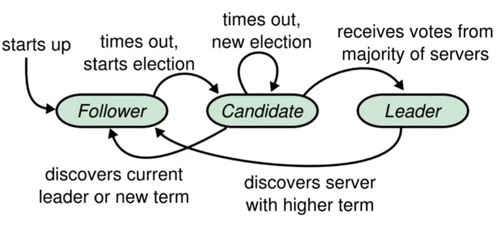
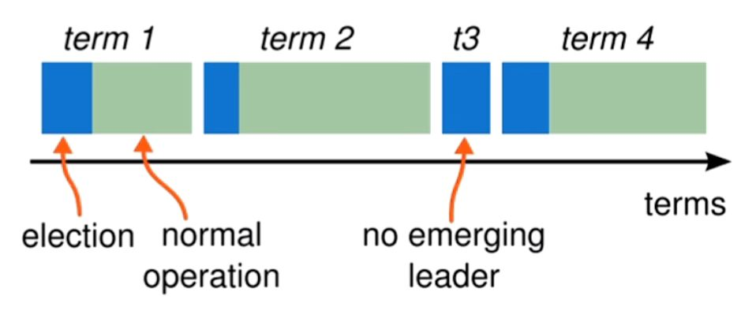
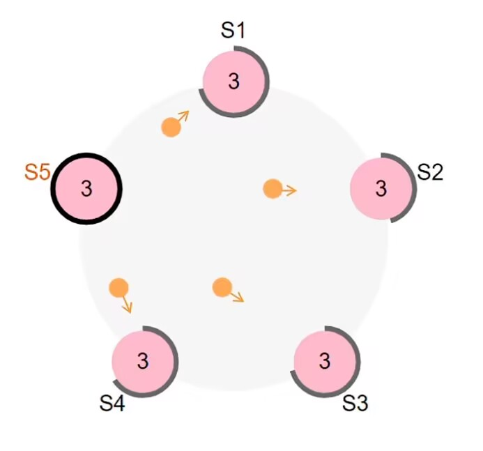
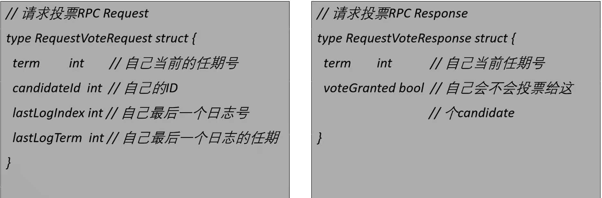
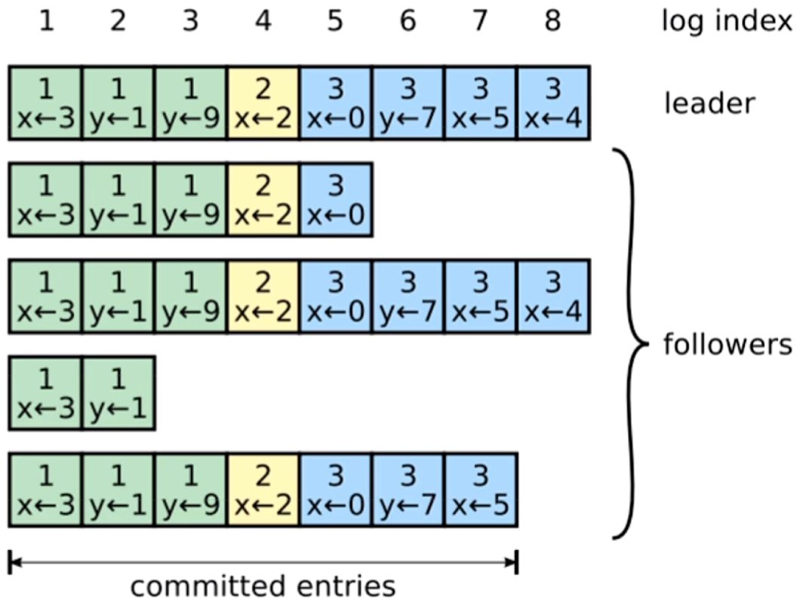
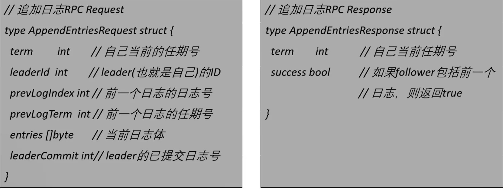

# Raft 共识算法

!!! note "本文非原创，仅供个人使用"

- [原视频链接](www.bilibili.com/video/BV1pr4y1b7H5)

## 1. 复制状态机

复制状态机的 **核心思想** ：相同的初始状态 + 相同的输入 = 相同的结束状态

多个节点上，从最初的初始状态开始，执行相同的一串命令，产生相同的最终状态

在 Raft 中，Leader 将客户端请求封装在一个个 Log Entry 中，并将它们复制到所有的 Follower 节点。Follower 节点按照相同的顺序应用 Log Entry 中的 Command，根据复制状态机理论，所有 Follower 节点的结束状态应该是一样的。

使用共识算法的目的是为了实现复制状态机。分布式场景下的各节点就是通过共识算法来保证命令序列的一致，从而始终保持它们的 **状态一致** (投票选举是一种特殊的命令)

## 2. 状态简化

在任何时刻，每一个服务器节点都处于 **Leader**，**Follower** 或 **Candidate** 这三个状态之一

Raft 把时间分割成任意长度的 **任期（term）** ，用连续的整数进行标记

每一段任期从一次选举开始。在某些情况下，一次选举无法选出 Leader（比如两个节点收到了相同的选票），在这种情况下，这一任期会以没有 Leader 结束；一个新的任期（包含一次新的选举）会很快重新开始。Raft 保证在任意一个任期内，最多只有一个 Leader。

Raft 算法中服务器节点之间使用 RPC 进行通信，并且 Raft 中只有两种主要的 RPC：

- RequestVote RPC（请求投票）：由 Candidate 在选举期间发起。
- AppendEntries RPC（追加条目）：由 Leader 发起，用来复制日志和提供一种心跳机制。

服务器之间通信的时候会 **交换当前任期号** ；如果一个服务器上的当前任期号比其他的小，该服务器会将自己的任期号更新为较大的那个值。

如果一个 Candidate 或者 Leader 发现自己的任期号过期了，它会立即回到 Follower 状态。

如果一个节点接收到一个包含过期的任期号的请求，他会直接拒绝这个请求。

## 3. 领导者选举

Raft 内部有一种 **心跳机制** ， 如果存在 Leader，那么它会周期性地向所有的 Follower 发送心跳来维持自己的地位。如果 Follower 一段时间没有收到心跳，那么他就会认为系统中没有可用的 Leader，然后开始进行选举。

开始一个选举过程后，Follower 先 **增加自己的当前任期号** 并转换到 Candidate 状态。然后 **投票给自己** ，并且并行地向集群中地其他服务器节点发送投票请求（RequestVote RPC）。

领导者选举最终会有三种结果：

1. 它获得了**超过半数选票**赢得了选举 -> 成为 Leader 并开始发送心跳
2. 其他节点赢得了选举 -> 收到 **新 Leader 的心跳** 后，如果 **新 Leader 的任期号不小于自己当前的任期号**，那么就从 Candidate 回到 Follower 状态。
3. 一段时间之后没有任何获胜者 -> 每个 Candidate 都在一个自己的 **随机选举超过时间** 后增加任期号开始新一轮投票。

- 为什么会没有获胜者？比如有多个 Follower 同时成为 Candidate，得票太过分散，没有任何一个 Candidate 得票超过半数。
- 论文中给出的随机选举超时时间为 150~300 ms，但具体的超时时间要视具体情况而定。

对于没有成为 Candidate 的 Follower 节点，对于同一个任期，会按照 **先来先得** 的原则投出自己的选票。此外，Candidate 的 任期 term 要大于 Follower 的 term，才有可能让 Follower 投出选票。

为什么 RequestVote RPC 要有 Candidate 最后一个日志的信息呢，**安全性** 子问题中会给出进一步的说明。

## 4. 日志复制

Leader 被选举出来后，开始为客户端提供服务。

客户端怎么知道新 Leader 是哪个节点？客户端随机向一个节点发送请求：

1. 该节点为 Leader，直接执行指令。
2. 该节点是 Follower，可以通过心跳得知 Leader 的 ID，进而告知客户端该找谁。
3. 该节点宕机，重复上述步骤。

只要集群中超过半数的节点可用，Raft 集群就能正常提供服务。

Leader 接收到客户端的指令后，会把指令作为一个新的条目追加到日志中去。

一条日志中需要具有三个信息：

- 状态机指令
- Leader 的任期号
- 日志号（日志索引）

日志号单调递增，但是日志号相同的日志有时内容会不同，比如 Leader 宕机，所以只有日志号和任期号两个因素才能唯一确定一个日志。

- Leader **并行** 发送 AppendEntries RPC 给 Follower，让它们复制该条目。当该条目被超过半数的 Follower 复制后，Leader 就可以在本地执行该指令并把结果返回客户端。
- 我们把本地执行指令，也就是 Leader 应用日志与状态机这一步，称作 **提交**。

注意到，并不是所有 Follower 的进度都和 Leader 的进度相同的：

1. Follower 缓慢
2. Follower 宕机
3. Leader 宕机

在日志复制的过程中，Leader 或 Follower 随时都有崩溃或缓慢的可能性，Raft 必须要在有宕机的情况下继续支持日志复制，并且保证每个副本日志顺序的一致（以保证复制状态机的实现）。具体有三种可能：

1. 如果有 Follower 因为某些原因没有给 Leader 响应，那么 Leader 会不断地重发追加条目请求（AppendEntries RPC），哪怕 Leader 已经回复了客户端，直至 Follower 追上日志。
2. 如果有 Follower 崩溃后恢复，这时 Raft 追加条目的一致性检查生效，保证 Follower 能按照顺序恢复崩溃后的缺失的日志。

- Raft 的一致性检查：Leader 在每一个发往 Follower 的追加条目 RPC 中，会放入前一个日志条目的索引位置和任期号，如果 Follower 在它的日志中找不到前一个日志，那么它会拒绝此日志，Leader 收到 Follower 的拒绝后，会发送前一个日志条目，从而逐渐向前定位到 Follower 第一个缺失的日志。
- 如果想要的话，该协议可以被优化来减少被拒绝的AppendEntries RPC的个数。例如，当拒绝一个AppendEntries RPC的请求的时候，Follower可以包含冲突条目的任期号和自己储存的那个任期的第一个index。借助这些信息，Leader可以跳过那个任期内所有冲突的日志条目来减小nextIndex；这样就变成每个有冲突日志条目的任期需要一个AppendEntries RPC而不是每个条目一次。但是在实践中，论文作者认为这种优化是没有必要的，因为失败不经常发生并且也不可能有很多不一致的日志条目。

3. 如果Leader崩溃，那么崩溃的Leader可能已经复制了日志到部分Follower但还没有提交，而被选出的新Leader又可能不具备这些日志，这样就有部分Follower中的日志和新Leader的日志不相同。
   - Raft在这种情况下，Leader通过强制Follower复制他的日志来解决不一致的问题，这意味着Follower中跟Leader冲突的日志条目会被新Leader的日志条目覆盖（因为没有提交，所以不违背外部一致性）。

通过这种机制，Leader在当权之后就不需要任何特殊的操作来使日志恢复到一致状态。

Leader只需要进行正常的操作，然后日志就能在回复AppendEntries一致性检查失败的时候自动趋于一致。

Leader从来不会覆盖或者删除自己的日志条目。（Append-Only）

这样的日志复制机制，就可以保证一致性特性：

- 只要过半的服务器能正常运行，Raft就能够接受、复制并应用新的日志条目
- 在正常情况下，新的日志条目可以在一个RPC来回中被赋值给集群中的过半机器
- 单个运行慢的Follower不会影响整体的性能

提交是一个非常重要的状态，对于Follower而言，接收到的日志并不能立即提交，因为这时候还没有确认日志被复制到了大多数节点，只有Leader确认了日志被复制到大多数节点后，Leader才会提交这个日志，即应用到状态机里。

如果leaderCommit > commitIndex，那么把commitIndex设为min(leaderCommit, index of last new entry)

## 5. 安全性

领导者选举和日志复制两个子问题实际上已经涵盖了共识算法的全程，但这两点还不能完全保证每一个状态机会按照相同的顺序执行相同的命令。

所以Raft通过几个补充规则完善整个算法，使算法可以在各类宕机问题下都不出错。这些规则包括：

1. Leader宕机处理：选举限制
2. Leader当即处理：新Leader是否提交之前任期内的日志条目
3. Follower和Candidate当即处理
4. 时间与可用性限制
